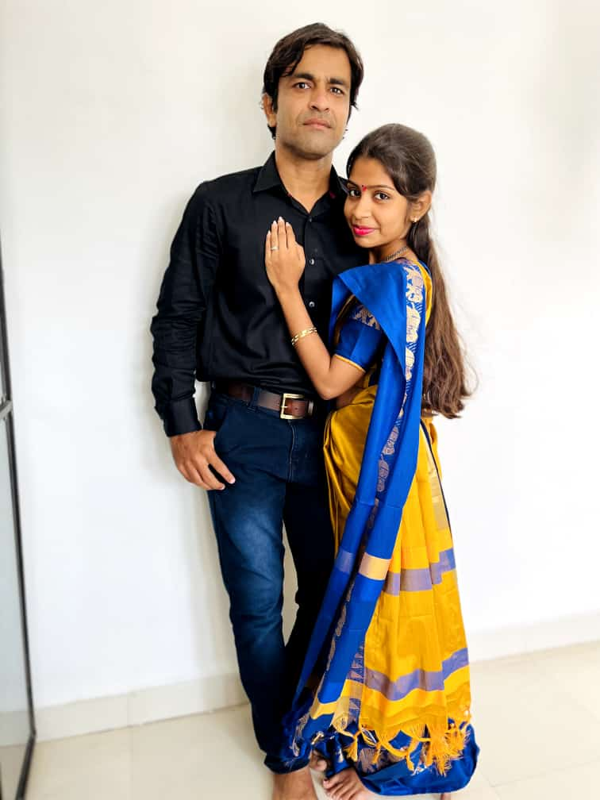
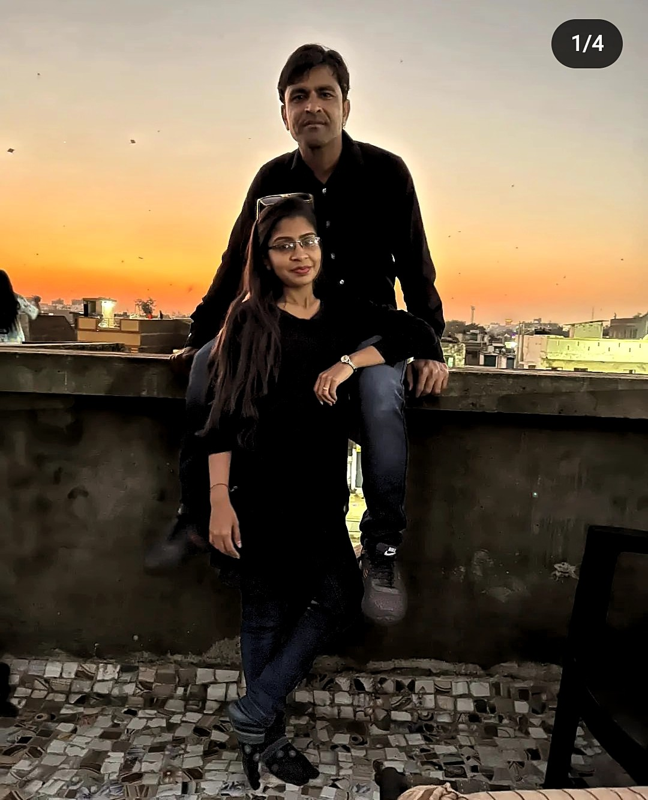
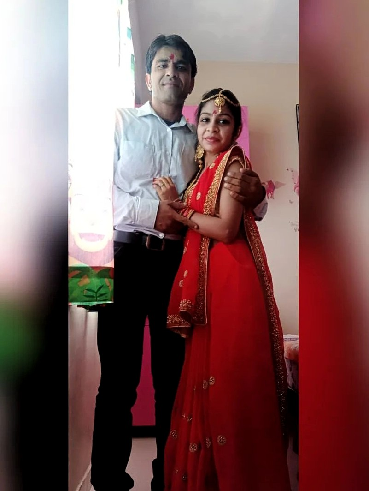
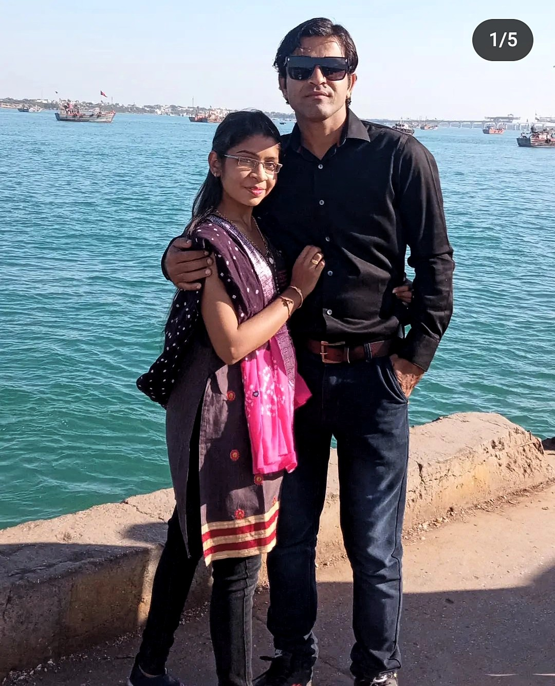
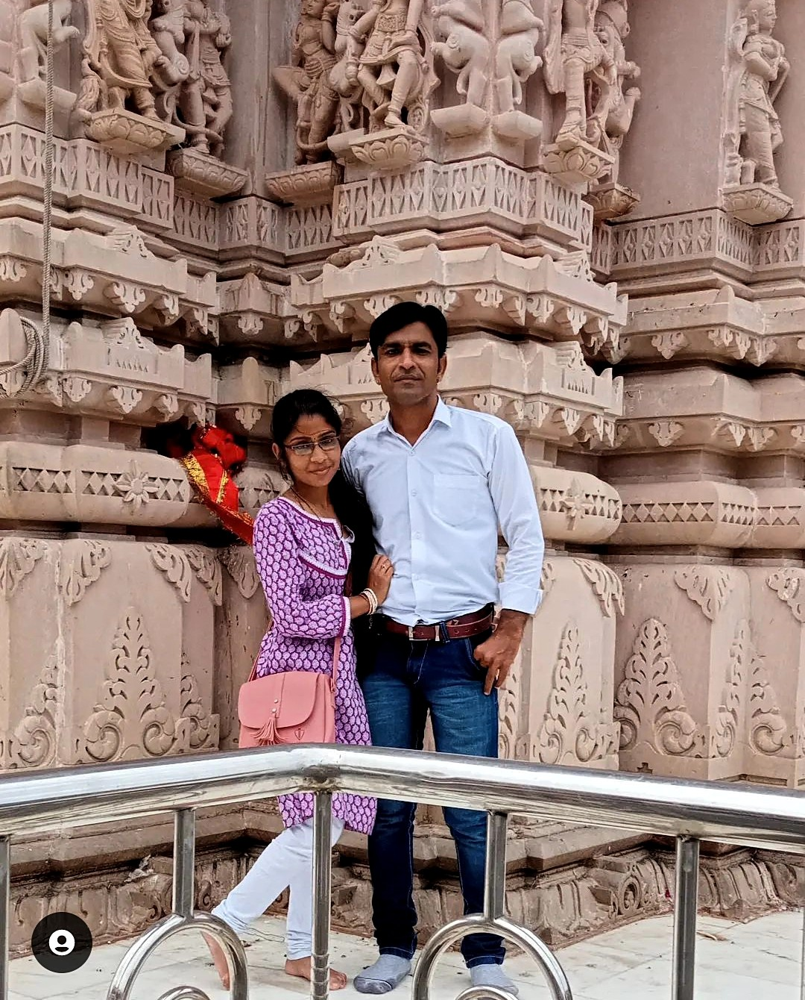
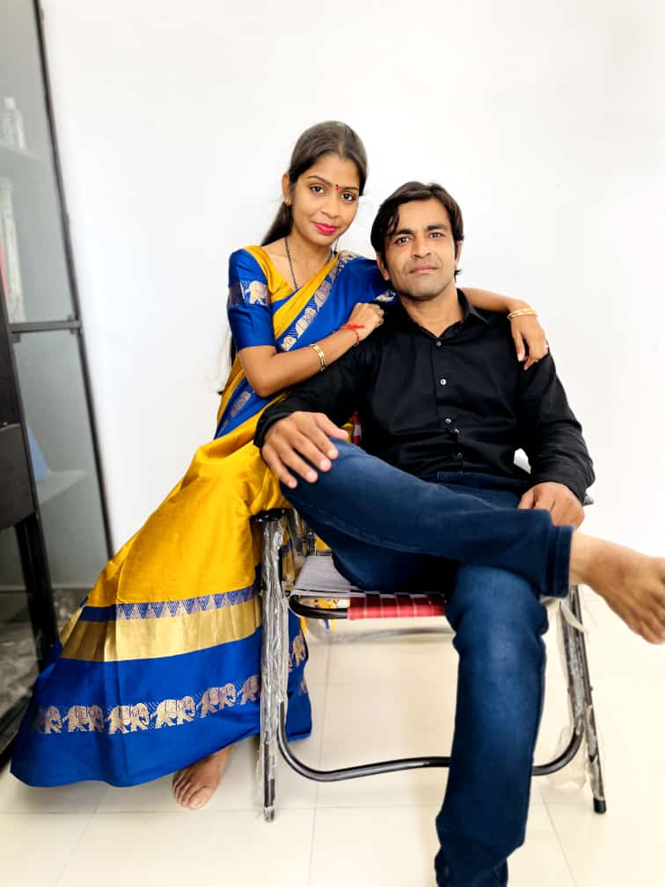
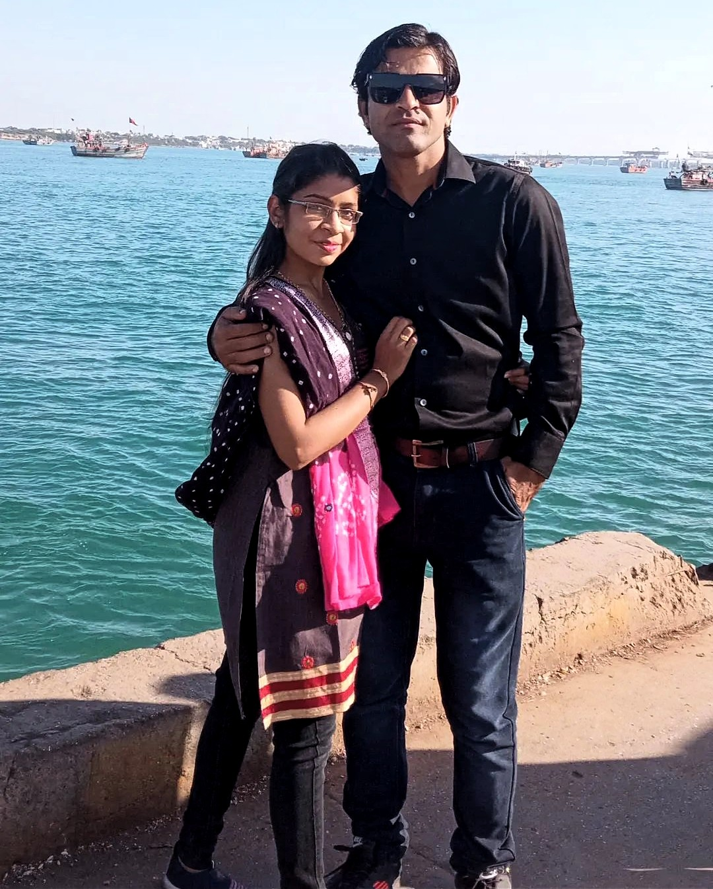

<!DOCTYPE html>
<html lang="en">
  <head>
    <meta charset="UTF-8" />
    <title></title>
    <link rel="stylesheet" href="./style.css" />
  </head>

  <body>
    <!-- partial:index.partial.html -->
    

      

        <!--  -->
        <!--  -->
        <!--  -->
        <!--  -->
        <!--  -->
        <!--  -->

        
        
        
        
        
        
        
        
        
        
        
        
        
        
        

        <!-- Example add video  -->
        <video controls autoplay="autoplay" loop>
          <source src="vid.mp4" type="video/mp4" />
        </video>

        <!-- Text at center of ground -->
        
Happy Marriage Life❤️

      

      

    

    
    <!-- partial -->
    
  </body>
</html>
